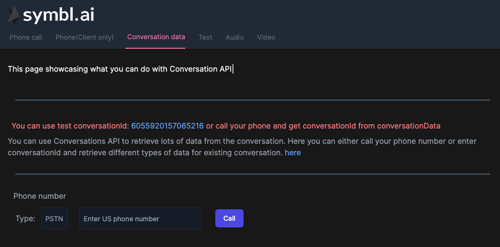
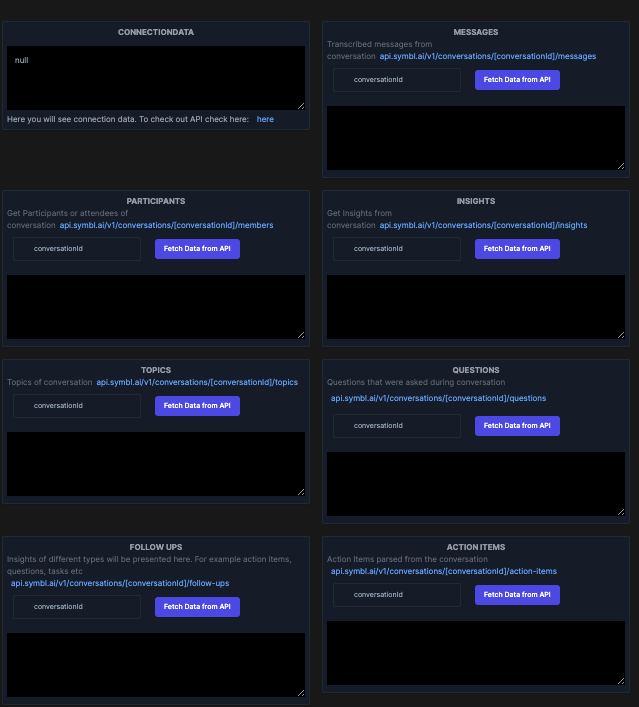
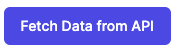

## Introduction

In this How to guide we will dive into how we can use Symbl AI Async API to retrieve data from conversation processed by Symbl. You can check other How To guides to see how to obtain conversationId that we will use to get Symbl insights. This guide is somewhat specific to React ecosystem and you can see the full code of how it's implemented within NextJS demo app [here](https://github.com/symblai/nextjs-symblai-demo).

The demo, that we will use in this How To has two parts. One is calling to our phone number and getting conversationId, which is described in details in [this How To guide](./how-to-next-telephony-rest.md). This can be done using this UI:



You can enter your phone number, and and click .

When submitting a phone number, the phone will be dialed and conversation will start. You will see in the UI bunch of JSON data that contributes to conversation. One of which will be conversationId. That Id can be used to retrieve conversational insights using [Conversation API](https://docs.symbl.ai/#conversation-api)

In the following UI, once conversation will start conversationId in input fields will be updated


And you will be able to click on  and get the data.

If you don't want to use telephony API to call your phone number you also can just paste conversationId that you've obtained in other methods and get the data.

## Get Started

We won't dive into all details of implementing NextJS app from scratch, so you always can check the [demo app code](https://github.com/symblai/nextjs-symblai-demo) for more info. Also feel free to open issues asking questions or writing suggestions.

#### Retrieve your credentials

In order to use Symbl API, you need to sign up and get your credentials. They include your `appId` and `appSecret`. You can find them on the home page of the platform.


add credentials to `next-config.js` file filling in `APP_ID` and `APP_SECRET` variables.

```javascript
module.exports = {
  env: {
    APP_ID: '',
    APP_SECRET: '',
  },
}
```

In order to see demo app in action, you can clone the repo, run `yarn` and then `yarn dev`.

Page you are looking for this tutorial is `/conversations` or this [file](https://github.com/symblai/nextjs-symblai-demo/blob/master/pages/conversations/index.tsx)

At first you will see the following. 

In order to see the app we will need to login.

### Authenticating

When using REST API, we would need to pass auth token in header. For that we've created component `ProtectedPage`. This component executes Symbl specific REST endpoint, to retrieve auth token and store it in context.

Later on we can retrieve this token from the helper hook `useAuth` which is basically a wrapper for `useContext`.

`export const useAuth = () => useContext(AuthContext)`

This is how we would retrieve the token:

```javascript
async function loginToSymbl() {
    const response = await fetch('https://api.symbl.ai/oauth2/token:generate', {
      method: 'POST',
      headers: {
        'Content-Type': 'application/json',
      },
      mode: 'cors',
      body: JSON.stringify({
        type: 'application',
        appId: process.env.APP_ID,
        appSecret: process.env.APP_SECRET,
      }),
    })
    const json = await response.json()
    console.log('Access Token is: ', json)
    setToken(json.accessToken)
```

Later on in any place in application we can use `const { token } = useAuth()` to get the token.

## Getting data from Conversation API

In order to get data from conversation API we will need to get **`conversationId`**. We can either use a demo id: `6055920157065216` or we can initiate the phone call using either Symbl Node SDK or Symbl REST api. Both flows will update `conversationId` parameter in the app and we will be able to retrieve data that we want.

In this demo app we have `<ConversationCard/>` component that will accept the following parameters:

```typescript
const ConversationCard = ({
  title,
  children,
  conversationId: cId,
  type,
}: {
  title: string
  conversationId: string
  children: JSX.Element
  type:
    | 'messages'
    | 'insights'
    | 'topics'
    | 'members'
    | 'questions'
    | 'follow-ups'
    | 'action-items'
}) => {}
```

This card component can render different data retrieved from Conversation API. The functionality is rather simple. Based on different types, card will render different data retrieved from Conversation API.

```typescript
const fetchData = async () => {
  const res = await fetch(
    `https://api.symbl.ai/v1/conversations/${conversationId}/${endpoint}`,
    {
      method: 'GET',
      headers: {
        'x-api-key': token as string,
        'Content-Type': 'application/json',
      },
      mode: 'cors',
    }
  )

  const json = await res.json()
  setResponseData(json)
}
```

You can read more about conversation API [here](https://docs.symbl.ai/#conversation-api)

## Summary

In this How To we've briefly walked you through the key points and flows that should be implemented in order to get your conversational insights.
Even though the code shared in this How To is React specific, The general flow can be used with any framework

1. Authenticate and get the token
2. Get `conversationId` either using telephony API or using async API explained in other How Tos
3. Use [Conversation API](https://docs.symbl.ai/#conversation-api) to get insights about your conversation.

```javascript
const endpoint =
  '`https://api.symbl.ai/v1/conversations/${conversationId}/${type}`'
```

while the type can be:

```
  type:
    | 'messages'
    | 'insights'
    | 'topics'
    | 'members'
    | 'questions'
    | 'follow-ups'
    | 'action-items'
```

You can read more about Conversation API [here](https://docs.symbl.ai/#conversation-api)
