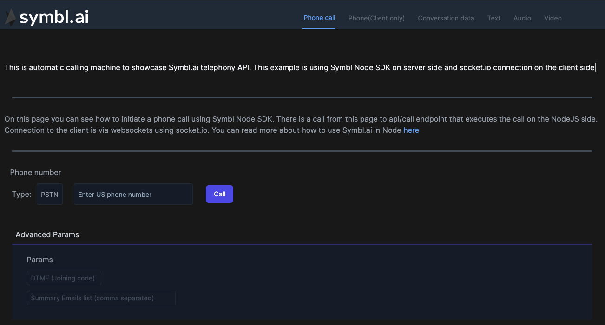
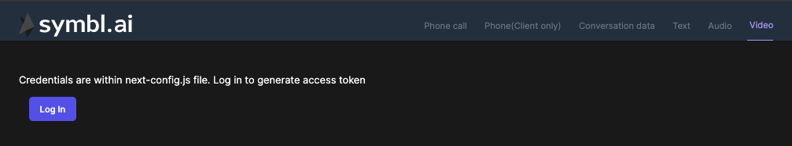

## Introduction

In this How to guide, we will see how we can use Symbl [telephony API](https://docs.symbl.ai/#real-time-telephony-api) to call on the phone or meeting url and get live transcription in NextJS app. Symbl comes with NodeJS api, so same thing we can get by using NodeJS SDK on the server side since there are some use cases that you would want to use particularly server side.For example if you want to do some business logic decisions based on the data received from symbl.

The main flow that we want to achieve is that you can enter your phone number in UI and hit on  button.

This is how the UI of the demo app will look like:



In addition to phone number, you can actually select whether you want to use Public Switched Telephony Networks (PSTN) or Session Initaition Protocol (SIP). You will be also able to add advanced params such as DTMF code or Summary email, where to send insights summary once conversation is finished

## Get Started

We won't dive into all details of implementing NextJS app from scratch, so you always can check the [demo app code](https://github.com/symblai/nextjs-symblai-demo) for more info. Also feel free to open issues asking questions or writing suggestions.

#### Retrieve your credentials

In order to use Symbl API, you need to sign up and get your credentials. They include your `appId` and `appSecret`. You can find them on the home page of the platform.


add credentials to `next-config.js` file filling in `APP_ID` and `APP_SECRET` variables.

```javascript
module.exports = {
  env: {
    APP_ID: '',
    APP_SECRET: '',
  },
}
```

In order to see demo app in action, you can clone the repo, run `yarn` and then `yarn dev`.

Page you are looking for this tutorial is `/phone` or this [file](https://github.com/symblai/nextjs-symblai-demo/blob/master/pages/phone/index.tsx)

At first you will see the following. 

In order to see the app we will need to login.

### Authenticating

When using REST API, we would need to pass auth token in header. For that we've created component `ProtectedPage`. This component executes Symbl specific REST endpoint, to retrieve auth token and store it in context.

Later on we can retrieve this token from the helper hook `useAuth` which is basically a wrapper for `useContext`.

`export const useAuth = () => useContext(AuthContext)`

This is how we would retrieve the token:

```javascript
async function loginToSymbl() {
    const response = await fetch('https://api.symbl.ai/oauth2/token:generate', {
      method: 'POST',
      headers: {
        'Content-Type': 'application/json',
      },
      mode: 'cors',
      body: JSON.stringify({
        type: 'application',
        appId: process.env.APP_ID,
        appSecret: process.env.APP_SECRET,
      }),
    })
    const json = await response.json()
    console.log('Access Token is: ', json)
    setToken(json.accessToken)
```

Later on in any place in application we can use `const { token } = useAuth()` to get the token.

## Calling phone or meeting using REST API

First of all what we need to do is to collect parameters from the user to send to Symbl Telephoni REST API, so Symbl will know how to initiate the call and how to process the conversation.

- `type` - Symbl supports two meetings types. `PSTN` and `SIP`
- `phoneNumber` - Naturally we need to have a phone number to call, but in case of `SIP` type we will need to call url. Something like `sip:124@domain.com`. For simplicity we will pass this data under `phoneNumber` parameter.
- `dtmf` - This will be meeting code, which we need to pass in case meeting has such a code
- `summaryEmail` - you can pass a list of emails which will get summary of the call email.
- `insightTypes` - there are several insight types that we can pass to Symbl.

Collecting these parameters is basically a set of React controlled input fields. You can check component `PhoneConfigurations.tsx` if you are curious how it's implemented.

This component have two different behaviours. One is calling `api/call` route, that we've covered in (how-to-nextjs-node-sdk.md)[./how-to-nextjs-node-sdk.md] guide. The other version of it is basically instead of calling `api/call` with user entered parameters, to call

`https://api.symbl.ai/v1/endpoint:connect`

This will look like this:

```typescript
const phoneNumberOrUri =
  type === 'sip' ? { uri: _phoneNumber } : { phoneNumber: _phoneNumber }
const res = await fetch('https://api.symbl.ai/v1/endpoint:connect', {
  method: 'POST',
  headers: {
    'x-api-key': token as string,
    'Content-Type': 'application/json',
  },
  mode: 'cors',
  body: JSON.stringify({
    operation: 'start',
    endpoint: {
      type,
      ...phoneNumberOrUri,
      dtmf,
    },
    insightTypes,
    actions: [
      {
        invokeOn: 'stop',
        name: 'sendSummaryEmail',
        parameters: {
          emails: summaryEmails.split(','),
        },
      },
    ],
    data: {
      session: {
        name: 'Call from nextjs Phone(Client only)',
      },
    },
  }),
})
```

When we will execute `fetch` call to `endpoint:connect` endpoint, you will get a phone call either on your phone or `sip` url according to what you've chosen in UI.

What we also need to do is to actually get a response of api call and set our connectionId in the app. We will do that by calling `connectionResponseHandler` callback function that we pass to `PhoneConfigurations.tsx` component. There we will set our response as `conversationData` in our app.

## Connecting via websockets to get live transcriptions

Now when we've got our phone call, we need to have a way to get realtime insights on the ongoing conversation. What we will do is monitor `conversationData` changes and if it changes, we will start our websocket.

```typescript
useEffect(() => {
  let ws: any = null

  //Check if we have conversationData and if we haven't already started websocket connection
  if (conversationData && !ws) {
    ws = new WebSocket(
      `wss://api.symbl.ai/session/subscribe/${connectionId}?access_token=${token}`
    )
    ws.onmessage = (event: MessageEvent) => {
      const data = JSON.parse(event.data)
      if (data.type === 'message_response') {
        setMessages(data.messages)
      }
      if (data.type === 'transcript_response') {
        setLiveTranscript(data)
      }
      setRealTimeData(data)
    }
  }

  // cleanup method which will be called before next execution. in your case unmount.
  return () => {
    ws && ws.close
  }
}, [conversationData])
```

Here we will subscribe to Symbl websocket url `wss://api.symbl.ai/session/subscribe/${connectionId}?access_token=${token}` to get realtime insights on ongoing conversation.

We will get either `transcript_response` type or `message_response` type or `insight_response` type. For example `message_response` will look like this:

```json
{
  "type": "message_response",
  "messages": [
    {
      "from": {},
      "payload": {
        "content": "Yeah, tell us sir.",
        "contentType": "text/plain"
      },
      "duration": {
        "startTime": "2020-10-22T15:32:14.500Z",
        "endTime": "2020-10-22T15:32:16.000Z"
      }
    }
  ]
}
```

Now what is left is to render UI based on what data we get.

## Summary

In this How To we've briefly walked you through the key points and flows that should be implemented in order to use [Symbl Telephony API](https://docs.symbl.ai/#real-time-telephony-api) and start a phone call and subscribe to real time updates.
Even though the code shared in this How To is React specific, The general flow can be used with any framework

1. Authenticate and get the token
2. Call Telephoni API REST endpoint with correct parameters

```javascript
const endpoint = 'https://api.symbl.ai/v1/endpoint:connect'
```

3. Get as a response `conversationId`
4. Use [Conversation API](https://docs.symbl.ai/#conversation-api) to get insights about the text.

You can read more about Telephoni API [here](https://docs.symbl.ai/#real-time-telephony-api)
