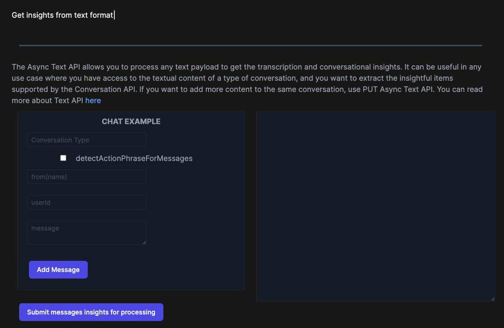
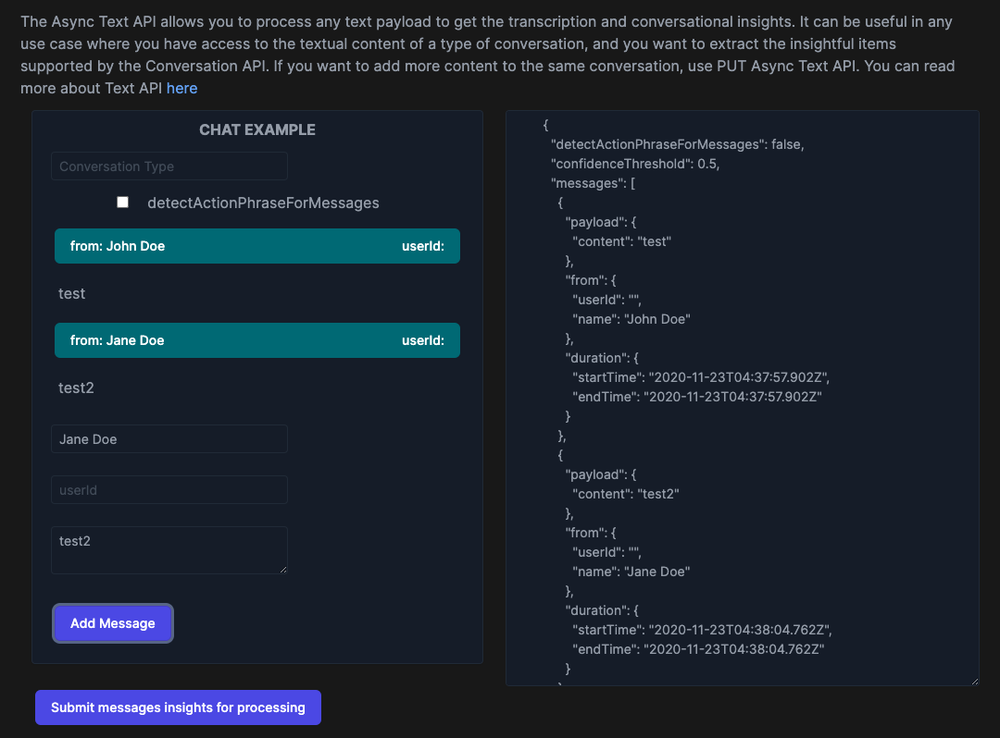
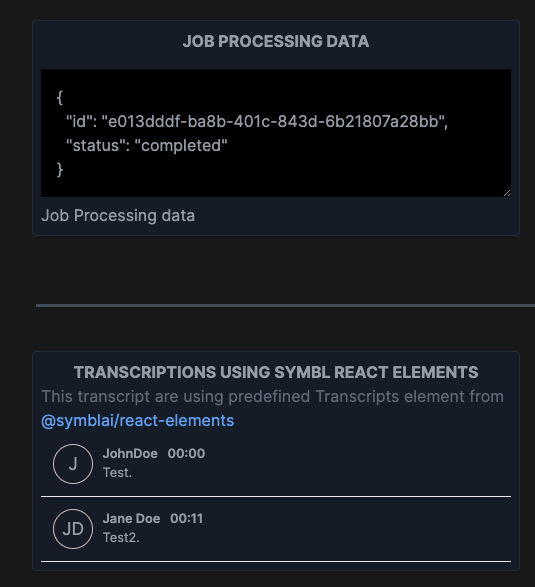
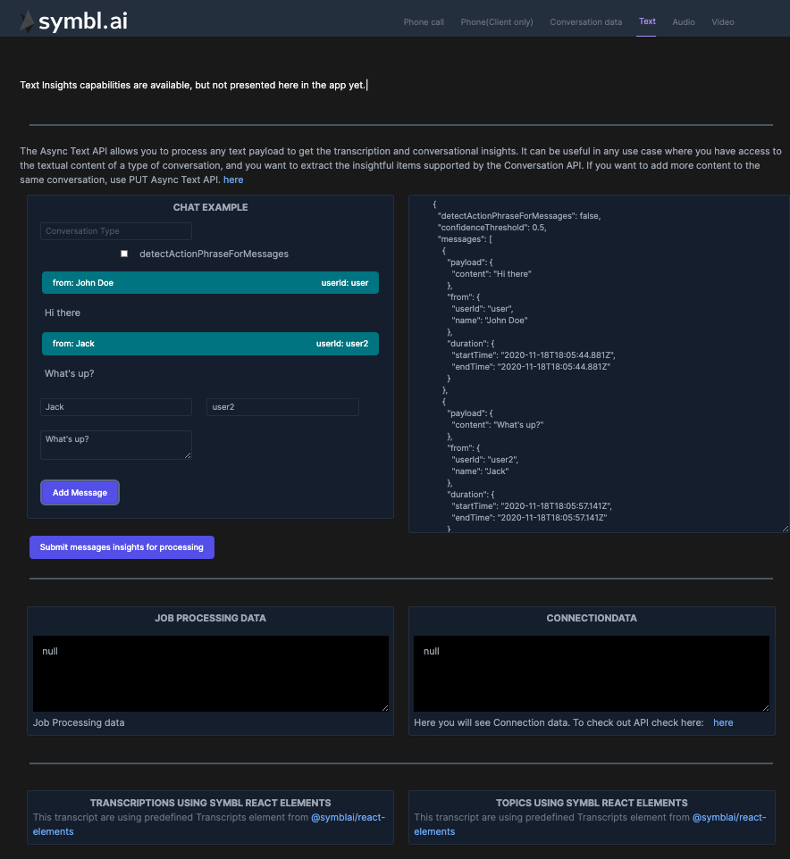

## Introduction

In this How to guide we will dive into how we can use Symbl AI Async API to retrieve insights about conversation. Conversation should be in the format compliant with [Messages API](https://docs.symbl.ai/#get-messages-transcript). This guide is somewhat specific to React ecosystem and you can see the full code of how it's implemented within NextJS demo app [here](https://github.com/symblai/nextjs-symblai-demo).

The main flow that we want to achieve is that you can submit a text in JSON format an input field and click .

This is how the UI of the demo app will look like:



On the left side there is a textfield where you can paste JSON in correct format, but for the convenience in this demo we've created UI, that helps you to construct messages in correct format by writing name and, message. userId and conversation type are optional.

You also have a flag `detectActionPhraseForMessages`. When true is passed it shows Actionable Phrases in each sentence of conversation.



When Text will be sent to processing, You will see in the UI bunch of JSON data that contributes to text processing and once processing is finished you can check out Text Transcripts, rendered using package `@symblai/react-elements`



## Get Started

We won't dive into all details of implementing NextJS app from scratch, so you always can check the [demo app code](https://github.com/symblai/nextjs-symblai-demo) for more info. Also feel free to open issues asking questions or writing suggestions.

#### Retrieve your credentials

In order to use Symbl API, you need to sign up and get your credentials. They include your `appId` and `appSecret`. You can find them on the home page of the platform.


add credentials to `next-config.js` file filling in `APP_ID` and `APP_SECRET` variables.

```javascript
module.exports = {
  env: {
    APP_ID: '',
    APP_SECRET: '',
  },
}
```

In order to see demo app in action, you can clone the repo, run `yarn` and then `yarn dev`.

Page you are looking for this tutorial is `/text` or this [file](https://github.com/symblai/nextjs-symblai-demo/blob/master/pages/text/index.tsx)

At first you will see the following. 

In order to see the app we will need to login.

### Authenticating

When using REST API, we would need to pass auth token in header. For that we've created component `ProtectedPage`. This component executes Symbl specific REST endpoint, to retrieve auth token and store it in context.

Later on we can retrieve this token from the helper hook `useAuth` which is basically a wrapper for `useContext`.

`export const useAuth = () => useContext(AuthContext)`

This is how we would retrieve the token:

```javascript
async function loginToSymbl() {
    const response = await fetch('https://api.symbl.ai/oauth2/token:generate', {
      method: 'POST',
      headers: {
        'Content-Type': 'application/json',
      },
      mode: 'cors',
      body: JSON.stringify({
        type: 'application',
        appId: process.env.APP_ID,
        appSecret: process.env.APP_SECRET,
      }),
    })
    const json = await response.json()
    console.log('Access Token is: ', json)
    setToken(json.accessToken)
```

Later on in any place in application we can use `const { token } = useAuth()` to get the token.

### Using Symbl Text Async API

The Async Text API allows you to process any text payload to get the transcription and conversational insights. It can be useful in any use case where you have access to the textual content of a type of conversation, and you want to extract the insightful items supported by the Conversation API. If you want to add more content to the same conversation, use [PUT Async Text API](https://docs.symbl.ai/#text-api).

Symbl Text async API will return `jobId` which we can monitor for completion by using polling mechanism. Once job is completed, we will get `conversationId` which we can use to retrieve data with Conversation API.

#### Text upload and processing

Text async API is built for particular format of messages list that you can upload and parse to get conversational insights. The format should look something like that:

```json
[
  {
    "payload": {
      "content": "Hi Mike, Natalia here. Hope you don’t mind me reaching out. Who would be the best possible person to discuss internships and student recruitment at ABC Corp? Would you mind pointing me toward the right person and the best way to reach them? Thanks in advance for your help, I really appreciate it!"
    },
    "from": {
      "userId": "natalia@example.com",
      "name": "Natalia"
    },
    "duration": {
      "startTime": "2020-07-21T16:02:19.01Z",
      "endTime": "2020-07-21T16:04:19.99Z"
    }
  },
  {
    "payload": {
      "content": "Hey Natalia, thanks for reaching out. I am connecting you with Steve who handles recruitements for us."
    },
    "from": {
      "userId": "mike@abccorp.com",
      "name": "Mike"
    },
    "duration": {
      "startTime": "2020-07-21T16:04:19.99Z",
      "endTime": "2020-07-21T16:04:20.99Z"
    }
  }
]
```

So we will have a textarea on the page where you can paste you content. Then in order to process it, you need to click  button.
For convenience we will also have "chat like" UI which we can use to build the json in the format mentioned above and submit it for processing.



Once you submit text for processing, there are several things that happen

#### 1. Get Relevant params for Text

You will see the following params defined within `useEffect`

```typescript
const requestTextOptions = {
  method: 'POST',
  headers: {
    'x-api-key': token,
    'Content-Type': 'application/json',
  },
  body: JSON.stringify({
    messages: JSON.parse(data),
  }),
}

const requestOptions = {
  method: 'GET',
  headers: {
    'x-api-key': token,
  },
}
```

3. #### Use Job API to poll for job status.

Previously we mentioned that there should be some kind of polling mechanism to check whether the job is finished or not. Symbl has [Job API](https://docs.symbl.ai/#job-api) That we can use for that.

```typescript
async function check(jobId: string) {
  const checkJob = await fetch(
    `https://api.symbl.ai/v1/job/${jobId}`,
    requestOptions
  )
  const checkJobJson = await checkJob.json()
  setJobStatus(checkJobJson)
  if (checkJobJson.status === 'in_progress') {
    check(jobId)
    return
  } else {
    setSentForProcessing(false)
  }
}
```

In this function we are polling the Job API endpoint passing a Job Id, which we've received as a response to from text async api. We will poll untill we get `completed` status.

4. Send text to processing

```typescript
// Execute the request
const processingResponse = await fetch(
  'https://api.symbl.ai/v1/process/text',
  requestTextOptions
)
const processingResponseJson = await processingResponse.json()
// Check Job Status
check(processingResponseJson.jobId)
```

After Job is finished we can get data from Conversation API. We will do that by using `<ConversationCard/>`component.

On this page you will also see this component `<Transcripts conversationId={conversationData.conversationId} />`

This is prebuilt component from `@symblai/react-elements` package. As soon as you provide it with `conversationId`, It will nicely render conversation transcripts. There is also `<Topics conversationId={conversationData.conversationId}/>` component that will do the same but for topics.

## Summary

In this How To we've briefly walked you through the key points and flows that should be implemented in order to send your text to processing and get insights on what was the conversation about. Conversation should be sent in a format of messages [Messages API](https://docs.symbl.ai/#get-messages-transcript). For that we've built a helper UI that helps creating messages in this format. It also supports pasting JSON.
Even though the code shared in this How To is React specific, The general flow can be used with any framework

1. Authenticate and get the token
2. Send text in correct format to correct endpoint

```javascript
const endpoint = 'https://api.symbl.ai/v1/process/text'
```

3. Get as a response `jobId`
4. Poll Job API endpoint to get processing status
   `https://api.symbl.ai/v1/job/${jobId}`
5. Get the `conversationId` back when processing is completed
6. Use [Conversation API](https://docs.symbl.ai/#conversation-api) to get insights about the text.

You can read more about Async Text API [here](https://docs.symbl.ai/#text-api)
