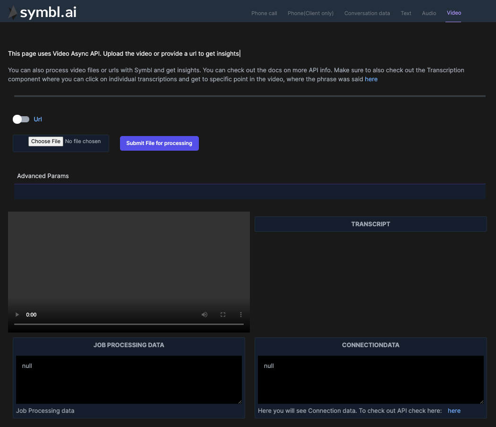
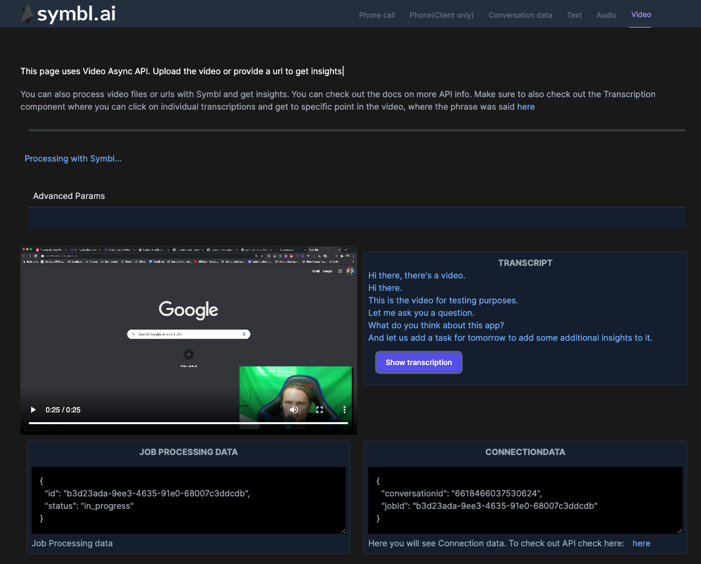

## Introduction

In this How to guide we will dive into how we can use Symbl AI Async API to retrieve insights on Video File or URL. This guide is somewhat specific to React ecosystem and you can see the full code of how it's implemented within NextJS demo app [here](https://github.com/symblai/nextjs-symblai-demo).

The main flow that we want to achieve is that you can upload a video file or paste a URL within an input field and click .

This is how the UI of the demo app will look like:



When Video will be sent to processing, You will see in the UI bunch of JSON data that contributes to video processing and once processing is finished you can check out Video Transcripts and even navigate these transcripts to move to specific part of the video by clicking on the transcript.



## Get Started

We won't dive into all details of implementing NextJS app from scratch, so you always can check the [demo app code](https://github.com/symblai/nextjs-symblai-demo) for more info. Also feel free to open issues asking questions or writing suggestions.

#### Retrieve your credentials

In order to use Symbl API, you need to sign up and get your credentials. They include your `appId` and `appSecret`. You can find them on the home page of the platform.


add credentials to `next-config.js` file filling in `APP_ID` and `APP_SECRET` variables.

```javascript
module.exports = {
  env: {
    APP_ID: '',
    APP_SECRET: '',
  },
}
```

In order to see demo app in action, you can clone the repo, run `yarn` and then `yarn dev`.

Page you are looking for this tutorial is `/video` or this [file](https://github.com/symblai/nextjs-symblai-demo/blob/master/pages/video/index.tsx)

At first you will see the following. 

In order to see the app we will need to login.

### Authenticating

When using REST API, we would need to pass auth token in header. For that we've created component `ProtectedPage`. This component executes Symbl specific REST endpoint, to retrieve auth token and store it in context.

Later on we can retrieve this token from the helper hook `useAuth` which is basically a wrapper for `useContext`.

`export const useAuth = () => useContext(AuthContext)`

This is how we would retrieve the token:

```javascript
const { token, setToken } = useAuth()

async function loginToSymbl() {
    const response = await fetch('https://api.symbl.ai/oauth2/token:generate', {
      method: 'POST',
      headers: {
        'Content-Type': 'application/json',
      },
      mode: 'cors',
      body: JSON.stringify({
        type: 'application',
        appId: process.env.APP_ID,
        appSecret: process.env.APP_SECRET,
      }),
    })
    const json = await response.json()
    console.log('Access Token is: ', json)
    setToken(json.accessToken)
```

As you can see there is a specific endpoint to generate the token by providing correct `APP_ID` or `APP_SECRET`

Later on in any place in application we can use `const { token } = useAuth()` to get the token.

### Using Symbl Video Async API

Symbl Video async API is used to process video file or url and return `jobId` which we can monitor for completion using [Job API](https://docs.symbl.ai/#job-api) by using polling mechanism and checking job status. Once job is completed, we will get `conversationId` which we can use to retrieve data with the help of [Conversation API](https://docs.symbl.ai/#conversation-api).

#### File Upload and processing.

If you look at `pages/video/index.tsx` file, you will notice that for file upload we are using

```typescript
<FileOrUrlInput onSubmit={onVideoSubmit} />
```

We won't dive into how it's implemented but basically the idea is to toggle between URL or file input. Once you click on the button , it will call `onVideoSubmit` function passing either URL or file.

```typescript
const onVideoSubmit = async (data: FileOrUrlInputSubmitType) => {
  setConversationData(null)
  if (data.type === 'file') {
    setFile(data?.file as any)
  } else {
    setVideoUrl(data?.url as string)
  }
}
```

This will set our state.
All the processing is done within `useAsyncVideoApi` hook.

```typescript
const { jobStatus, sentForProcessing } = useAsyncVideoApi(
  videoUrl !== '' ? videoUrl : file,
  asyncApiParams.query
)
```

This hook monitors the state change using dependency array of `useEffect` and when state is changed it will start the flow.

#### 1. Get Relevant params for Video URL or file

First we need to get relevant parameters for the Video URL or file. the difference is mainly the `Content-Type`.

You will see the following function defined within `useEffect`

```typescript
async function getFileOrUrlOptions() {
  if (isFile) {
    const file = data
    const requestOptionsVideo = {
      method: 'POST',
      headers: {
        'x-api-key': token,
        'Content-Type': 'video/mp4',
      },
      body: file,
      json: true,
    }
    return requestOptionsVideo
  } else {
    const url = data
    const requestOptionsVideo = await {
      method: 'POST',
      headers: {
        'x-api-key': token,
        'Content-Type': 'application/json',
      },
      body: JSON.stringify({
        url: url,
        confidenceThreshold: 0.6,
        timezoneOffset: 0,
      }),
    }
    return requestOptionsVideo
  }
}
```

Here we define a function to conditionally get different request parameters that we need to send in our REST call. After all there is a difference whether we send a file or URL

2. Getting Symbl async Video API endpoint.

Async API endpoint for video processing will change based on whether it's url or file:

```javascript
const urlVideo = isFile
  ? `https://api.symbl.ai/v1/process/video${query}`
  : `https://api.symbl.ai/v1/process/video/url${query}`
```

We will use this endpoint to send video url or video file for processing. THis endpoint will also accept a query string which we will use later on to pass parameters.

3. #### Use Job API to poll for job status.

Previously we mentioned that there should be some kind of polling mechanism to check whether the job is finished or not. Symbl has [Job API](https://docs.symbl.ai/#job-api) That we can use for that.

```typescript
async function check(jobId: string) {
  const checkJob = await fetch(
    `https://api.symbl.ai/v1/job/${jobId}`,
    requestOptions
  )
  const checkJobJson = await checkJob.json()
  setJobStatus(checkJobJson)
  if (checkJobJson.status === 'in_progress') {
    check(jobId)
    return
  } else {
    setSentForProcessing(false)
  }
}
```

In this function we are polling the Job API endpoint passing a Job Id, which we've received as a response to from video async api. We will poll untill we get `completed` status

4. Send video to processing

```typescript
//Get request Parameters
const requestOptionsVideo = await getFileOrUrlOptions()
// Execute the request
const processingResponse = await fetch(urlVideo, requestOptionsVideo)
const processingResponseJson = await processingResponse.json()
// Check Job Status
check(processingResponseJson.jobId)
```

After Job is finished we can get data from Conversation API. We will do that by using `<ConversationCard/>`component.

On this page you will also see this component `<Transcripts conversationId={conversationData.conversationId} />`

This is prebuilt component from `@symblai/react-elements` package. As soon as you provide it with `conversationId`, It will nicely render conversation transcripts. There is also `<Topics conversationId={conversationData.conversationId}/>` component that will do the same but for topics, which Symbl will recognize as main topics within the conversation.

### Passing additional Async API parameters to get more granular insights

We can pass various parameters to improve processing of video files. These parameters can be passed as a query string to video processing endpoint.
Such parameters may include:

- `customVocabulary` - Contains a list of words and phrases that provide hints to the speech recognition task.
- `detectActionPhraseForMessages` - Accepted values are true & false. It shows Actionable Phrases in each sentence of conversation. These sentences can be found in the Conversation's [Messages API](https://docs.symbl.ai/#get-messages-transcript).

Diarization parameters. You can read more about them [here](https://docs.symbl.ai/#audio-api)

## Summary

In this How To we've briefly walked you through the key points and flows that should be implemented in order to send your video to processing and get insights on what was the conversation in the video about. Even though the code shared in this How To is React specific, The general flow can be used with any framework

1. Authenticate and get the token
2. Send video url/file to correct endpoint

```javascript
const endpoint = isFile
  ? `https://api.symbl.ai/v1/process/video${query}`
  : `https://api.symbl.ai/v1/process/video/url${query}`
```

3. Get as a response `jobId`
4. Poll Job API endpoint to get processing status
   `https://api.symbl.ai/v1/job/${jobId}`
5. Get the `conversationId` back when processing is completed
6. Use [Conversation API](https://docs.symbl.ai/#conversation-api) to get insights about the video.

You can read more about Async Video API [here](https://docs.symbl.ai/#video-api)
